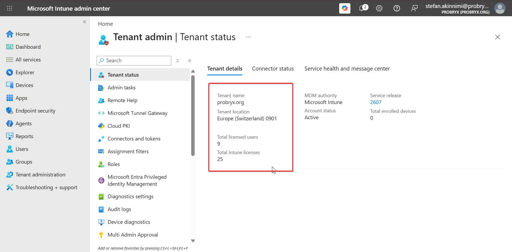
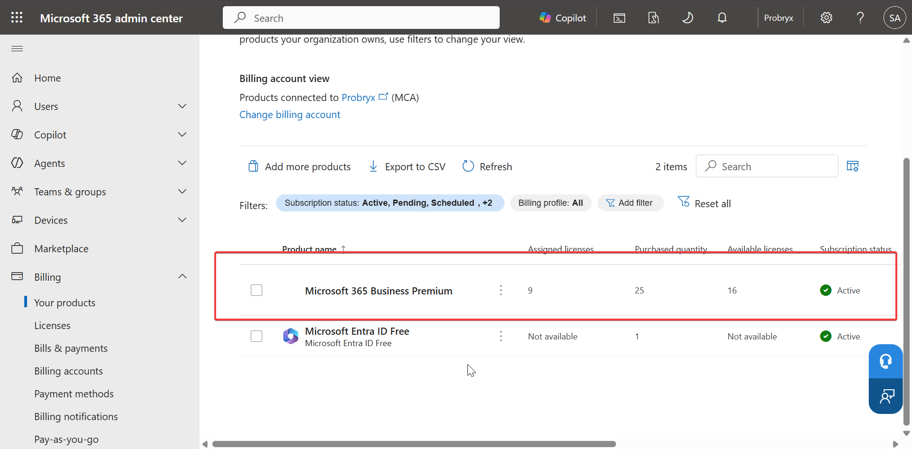
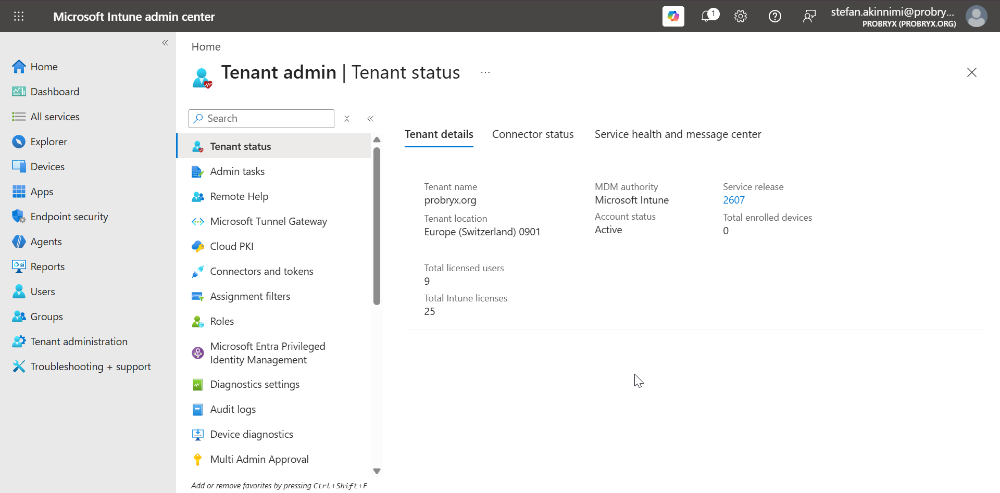
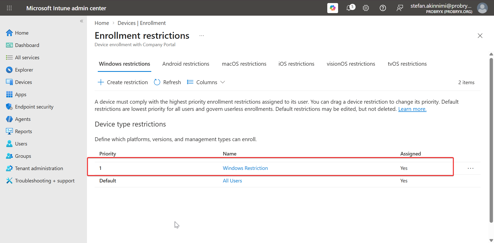
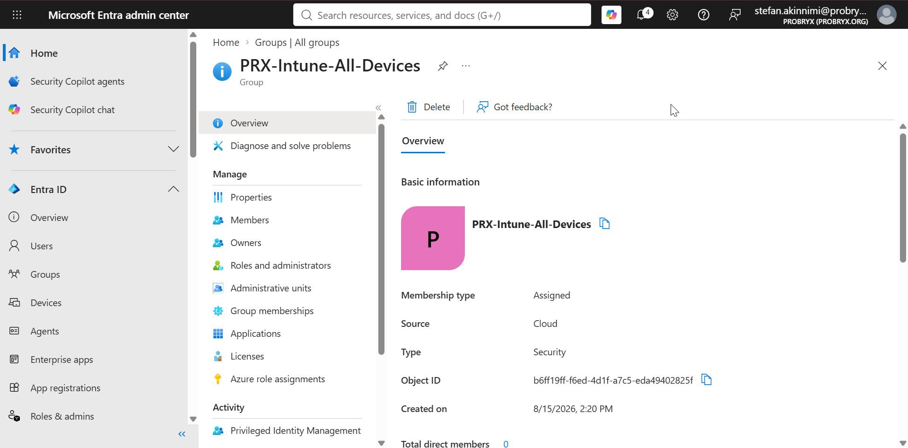
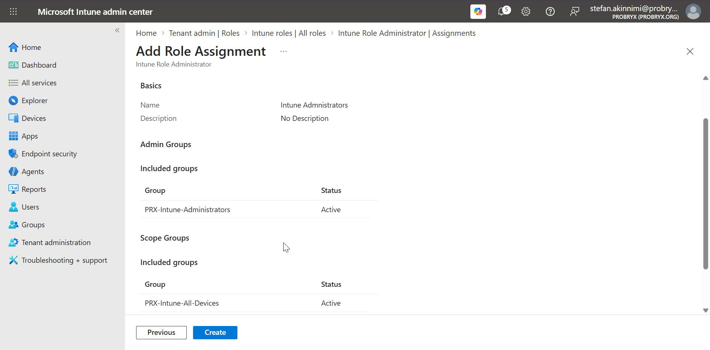

# ⚙️ Intune Configuration

## 🎯 Objective

In this stage, I configured Microsoft Intune as the device management platform for my Microsoft 365 lab environment.

The configuration establishes the foundation required to enroll and manage my three Windows 11 virtual devices.

---

## 🧩 Environment

| Component | Details |
|---|---|
| ☁️ Platform | Microsoft 365 |
| 🛡️ Device Management | Microsoft Intune |
| 🆔 Identity | Microsoft Entra ID |
| 💻 Virtualization | VMware Workstation |
| 🪟 Operating System | Windows 11 |
| 🖥️ Devices | PRX-WIN11-001, PRX-WIN11-002, PRX-WIN11-003 |

---

## 1️⃣ Open Microsoft Intune

1. I signed in to the [Microsoft Intune admin center](https://intune.microsoft.com/) using my administrator account.
2. From the admin center, I opened **Tenant administration** to review the Intune tenant configuration.
3. I confirmed that Microsoft Intune was available and ready for device management.

### 📸 Screenshot

---

## 2️⃣ Verify Intune Licensing

1. I opened the Microsoft 365 admin center.
2. Checked the available Microsoft 365 licenses under **Billing → Your products**.
3. Confirmed that the accounts I planned to use for the lab had licenses that included Microsoft Intune.
4. I verified that the required users were licensed before beginning device enrollment.

### 📸 Screenshot

---

## 3️⃣ Confirm MDM Authority

1. In the Intune admin center, I navigated to **Tenant administration → Tenant status**.
2. I reviewed the **MDM Authority** setting.
3. I confirmed that Microsoft Intune was configured as the mobile device management authority for the tenant.

### 📸 Screenshot

---

## 4️⃣ Configure Device Enrollment Settings

1. I navigated to **Devices → Enrollment**.
2. I reviewed the available enrollment options.
3. I configured the Windows enrollment settings required for my lab environment.
4. I kept the configuration focused on organization-owned Windows devices because my lab uses three Windows 11 virtual machines.

---

## 5️⃣ Configure Enrollment Restrictions

1. I opened **Devices → Enrollment → Enrollment restrictions**.
2. I reviewed the default device and platform restrictions.
3. I configured the restrictions to allow the Windows devices required for the project.
4. I reviewed the assignment scope to ensure the settings applied to the intended users.

### 📸 Screenshot

---

## 6️⃣ Create Device Groups

I created Microsoft Entra security groups to make Intune policy assignments easier to manage.

### Groups

| Group | Purpose |
|---|---|
| `PRX-Intune-All-Devices` | Contains all Intune-managed devices |
| `PRX-Intune-Windows11` | Targets Windows 11 devices |
| `PRX-Intune-Users` | Contains users participating in the Intune lab |

I added the three lab users and devices to the appropriate groups as they became available.

### 📸 Screenshot

---

## 7️⃣ Configure Intune RBAC

1. I reviewed **Tenant administration → Roles → All roles** and identified the **Intune Administrator** role.
2. I created the Microsoft Entra security group **`PRX-Intune-Administrators`**.
3. I added **Stefan Akinnimi** as a member of the group.
4. I assigned the **Intune Administrator** role to `PRX-Intune-Administrators`.
5. I scoped the role assignment to **`PRX-Intune-All-Devices`** so the administrator can manage the devices in my Intune lab.
6. This allows me to demonstrate group-based role assignment and least-privilege administration instead of relying solely on Global Administrator access.

### 📸 Screenshot

---

## 8️⃣ Review Scope Tags

1. I opened **Tenant administration → Roles → Scope tags**.
2. I reviewed the default scope configuration.
3. For this small lab, I kept scope tagging simple and avoided unnecessary segmentation.

---

## 9️⃣ Review Device Enrollment Status

After completing the basic Intune configuration, I reviewed the enrollment area to confirm that the tenant was ready to receive Windows devices.

At this point, the environment was ready for the next stage:

**Device Enrollment → Windows Autopilot → Device Configuration**

---

## ✅ Configuration Validation

I verified the following before moving forward:

- ✅ Microsoft Intune is available in the tenant.
- ✅ Required users have appropriate Intune licensing.
- ✅ Intune is configured as the MDM authority.
- ✅ Windows enrollment settings are configured.
- ✅ Enrollment restrictions allow the required Windows devices.
- ✅ Microsoft Entra groups are available for Intune assignments.
- ✅ Intune administrative roles have been reviewed.
- ✅ The tenant is ready for Windows device enrollment.

---

## 📌 Result

I completed the initial Microsoft Intune tenant configuration and established the foundation for managing my Windows 11 virtual devices.

The next stage is to enroll:

- `PRX-WIN11-001` — Damilola Ogunwole
- `PRX-WIN11-002` — Stefan Akinnimi
- `PRX-WIN11-003` — Jane Smith
