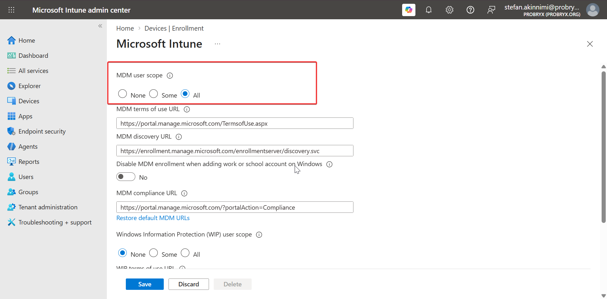
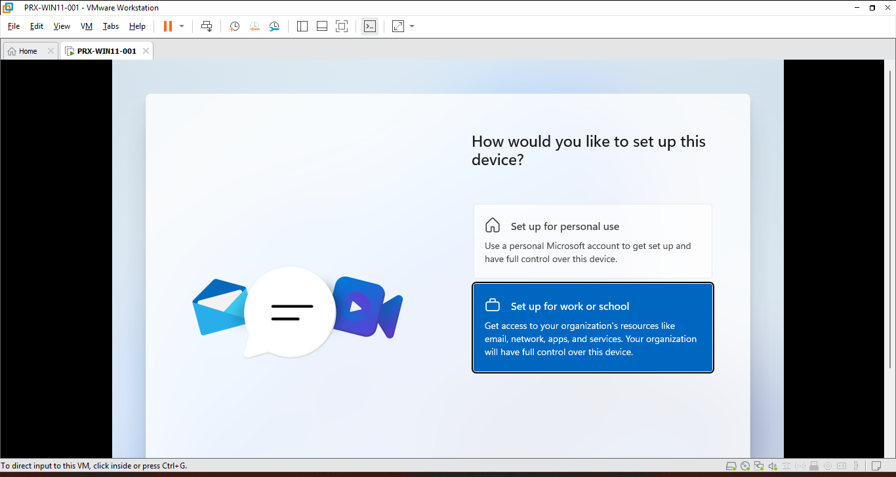
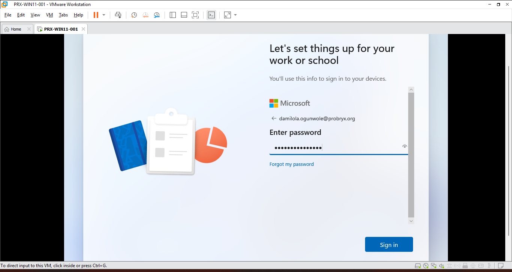
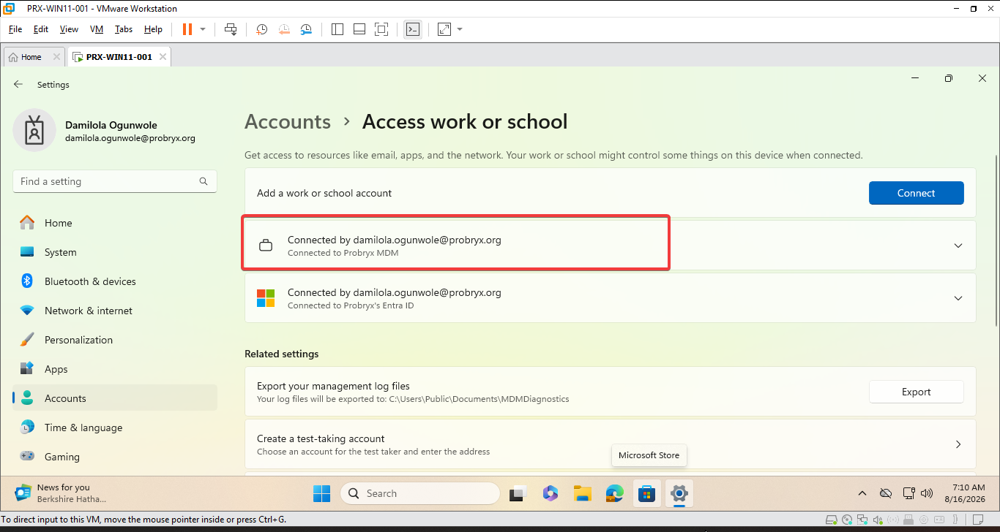
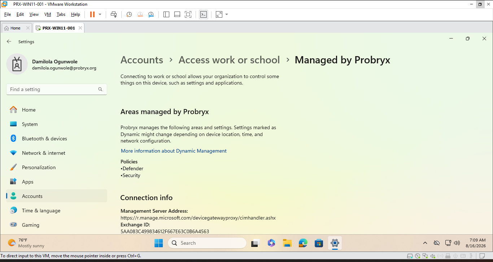
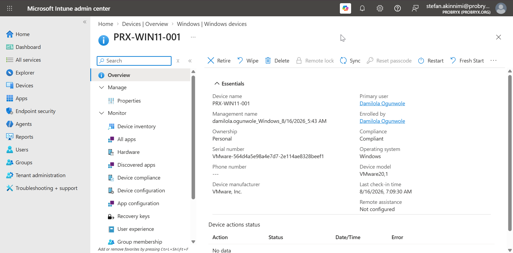

# 💻 Device Enrollment

## 🎯 Objective

In this stage, I will enroll my Windows 11 virtual devices into **Microsoft Entra ID and Microsoft Intune** using two different enrollment methods.

I will use the standard **Microsoft Entra Join with automatic Intune enrollment** for `PRX-WIN11-001` and `PRX-WIN11-002`, while `PRX-WIN11-003` and `PRX-WIN11-004` will be enrolled through **Windows Autopilot**. This allows me to demonstrate both standard device enrollment and Autopilot-based provisioning within the same Intune environment.

## 🖥️ Devices

| Device | User | Role |
|---|---|---|
| `PRX-WIN11-001` | Damilola Ogunwole | COO |
| `PRX-WIN11-002` | Stefan Akinnimi | IT Administrator |
| `PRX-WIN11-003` | Jane Smith | HR Manager |
| `PRX-WIN11-004` | Micheal Brown | Operations Manager |

---

## 1️⃣ Confirm Automatic Enrollment

Before enrolling the devices, I confirmed that automatic MDM enrollment was configured for the users in my lab.

1. I opened the **Microsoft Intune admin center**.
2. I went to **Devices → Enrollment**.
3. Under **Windows**, I opened **Automatic Enrollment**.
4. I confirmed that the **MDM user scope** included the users who would enroll the lab devices.
5. I saved the configuration where required.

### 📸 Screenshot

---

## 2️⃣ Enroll PRX-WIN11-001

I started with **PRX-WIN11-001**, assigned to **Damilola Ogunwole**. The virtual machine was created using a fresh Windows 11 installation.

1. I started **PRX-WIN11-001** in VMware Workstation.
2. I completed the initial Windows 11 setup steps, including selecting the **region** and **keyboard layout**.
3. After Windows checked for updates, I reached the account setup stage.
4. Instead of setting up a personal Microsoft account, I selected **Add a work or school account**.
5. I entered **Damilola Ogunwole's** Microsoft 365 account.
6. I authenticated the account and confirmed the organization details.
7. I selected the option to join the device to **Microsoft Entra ID**.
8. I completed the enrollment and Windows setup.
9. Windows finished configuring the device using the organizational account.

### 📸 Screenshots

---

## 3️⃣ Verify PRX-WIN11-001

After the join completed, I verified that the device was connected to my organization's Microsoft Entra ID and enrolled for management.

1. I opened **Settings → Accounts → Access work or school**.
2. I selected the organization connection.
3. I confirmed that the device was connected to Microsoft Entra ID.
4. I selected **Info** to view the management information and confirm the MDM connection.

### 📸 Screenshot

---

## 4️⃣ Verify PRX-WIN11-001 in Intune

I then verified the device from the Intune admin center.

1. I opened **Intune admin center → Devices → All devices**.
2. I searched for `PRX-WIN11-001`.
3. I opened the device record.
4. I confirmed the device appeared in Intune.
5. I reviewed the device owner, operating system, compliance status, and management information.

### 📸 Screenshot

---

## 5️⃣ Enroll PRX-WIN11-002

I repeated the same enrollment process for **PRX-WIN11-002**, assigning the device to **Stefan Akinnimi**.

1. I opened **Settings → Accounts → Access work or school**.
2. I selected **Connect → Join this device to Microsoft Entra ID**.
3. I signed in with **Stefan Akinnimi's** Microsoft 365 account.
4. I completed the Microsoft Entra join.
5. I signed in to Windows using the assigned account.
6. I verified the Intune connection from **Access work or school**.

### 📸 Screenshot

---

## 7️⃣ Verify All Devices

After enrolling all three devices, I returned to **Intune admin center → Devices → All devices** and confirmed that all three devices were present.

| Device | Assigned User | Intune Status |
|---|---|---|
| `PRX-WIN11-001` | Damilola Ogunwole | ✅ Enrolled |
| `PRX-WIN11-002` | Stefan Akinnimi | ✅ Enrolled |
| `PRX-WIN11-003` | Jane Smith | ✅ Enrolled |

### 📸 Screenshot

---

## ✅ Enrollment Validation

I verified that:

- ✅ All three Windows 11 VMs were Microsoft Entra joined.
- ✅ All three devices were enrolled in Microsoft Intune.
- ✅ Each device was assigned to the intended user.
- ✅ The devices appeared in **Intune → Devices → All devices**.
- ✅ I could view the MDM connection from Windows.
- ✅ The devices were ready for configuration and policy deployment.

## 📌 Result

The three Windows 11 virtual machines are now connected to my Microsoft 365 environment and managed through Microsoft Intune.

The enrolled devices are:

- `PRX-WIN11-001` → Damilola Ogunwole
- `PRX-WIN11-002` → Stefan Akinnimi
- `PRX-WIN11-003` → Jane Smith

The next stage is **Windows Autopilot**, where I will configure the devices for automated Windows provisioning and deployment.
