# 🪟 Windows Autopilot

## 🎯 Objective

In this stage, I configured Windows Autopilot for two Windows 11 virtual machines in my VMware lab.

I used **user-driven Microsoft Entra join** for both devices so Autopilot controls the Windows OOBE experience, joins the devices to Microsoft Entra ID, enrolls them into Intune, and applies the assigned configuration.

> ℹ️ **Lab note:** Microsoft does not support Windows Autopilot pre-provisioning on virtual machines. Because this project uses VMware virtual machines, I am using the supported **user-driven Autopilot** scenario for both Autopilot devices.

## 🖥️ Autopilot Devices

| Device | User | Deployment Method |
|---|---|---|
| `PRX-WIN11-003` | Jane Smith | User-driven Autopilot |
| `PRX-WIN11-004` | Michael Brown | User-driven Autopilot |

---

## 1️⃣ Prepare the Autopilot Devices

I created two fresh Windows 11 virtual machines in VMware Workstation:

- `PRX-WIN11-003`
- `PRX-WIN11-004`

Before completing Windows setup, I prepared the devices for Windows Autopilot registration.

---

## 2️⃣ Capture the Hardware Hash

Windows Autopilot requires the device hardware identity, known as the **hardware hash**, to be registered with the Windows Autopilot service.

For each VM, I opened PowerShell and used the Windows Autopilot information script to collect the hardware hash and serial number.

```powershell
Install-Script -Name Get-WindowsAutopilotInfo -Force
Set-ExecutionPolicy -Scope Process -ExecutionPolicy Bypass
Get-WindowsAutopilotInfo.ps1 -OutputFile C:\Autopilot\AutopilotHWID.csv
```

I repeated this process for both Autopilot devices.

### 📸 Screenshots

#### PRX-WIN11-003

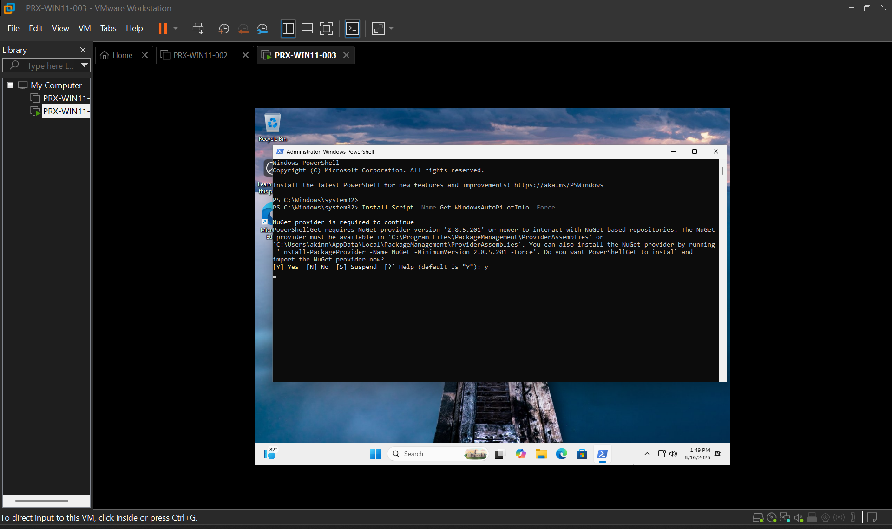

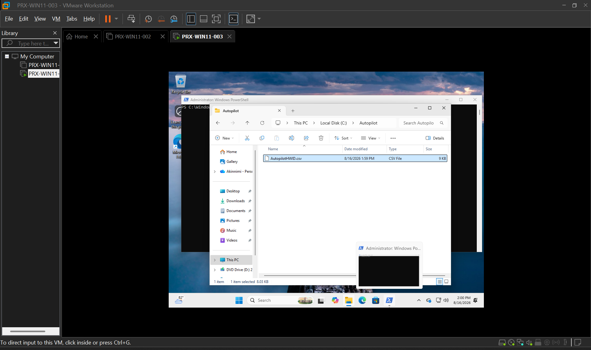

#### PRX-WIN11-004

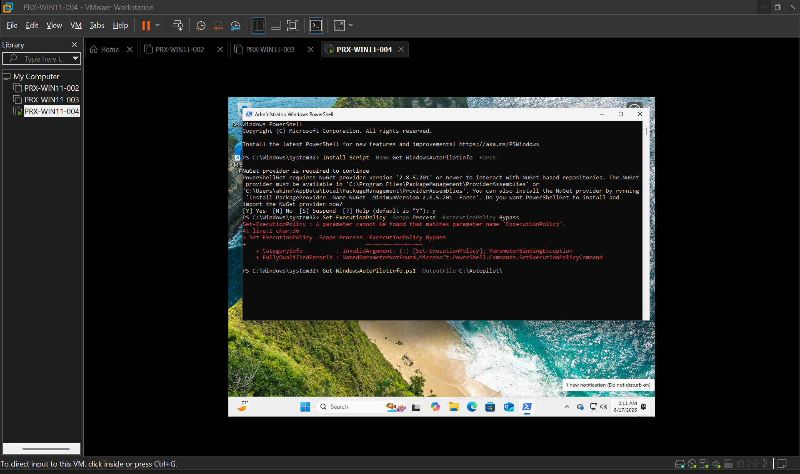

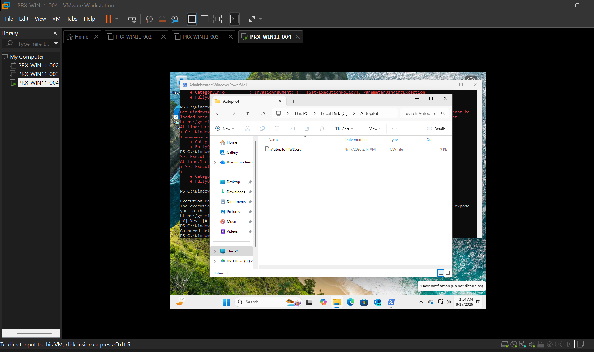


---

## 3️⃣ Register the Devices in Windows Autopilot

I uploaded the hardware hash information into Intune.

1. I opened **Intune admin center**.
2. I went to **Devices → Windows → Enrollment**.
3. Under **Windows Autopilot**, I opened **Devices**.
4. I selected **Import**.
5. I uploaded the CSV containing the hardware information.
6. I verified that both devices appeared in the Windows Autopilot device list.

### 📸 Screenshots

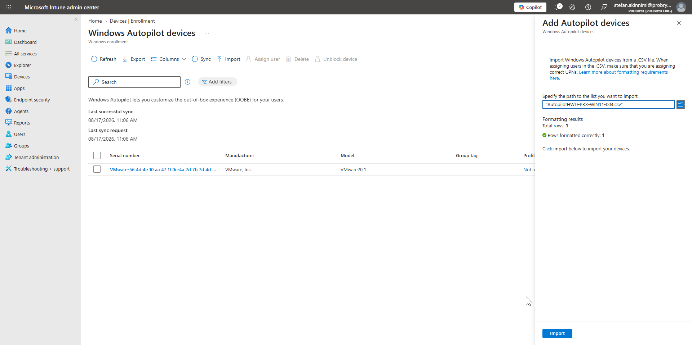

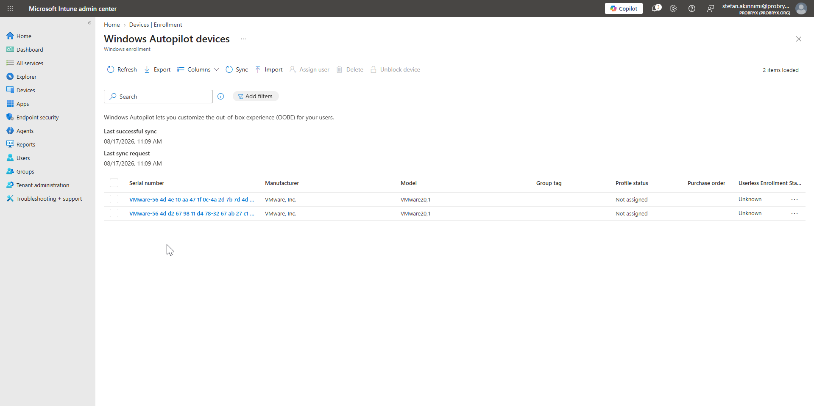

---

## 4️⃣ Create the Autopilot Device Group

I created a Microsoft Entra security group:

```text
PRX-Autopilot-Devices
```

I added:

- `PRX-WIN11-003`
- `PRX-WIN11-004`

to the group.

### 📸 Screenshot

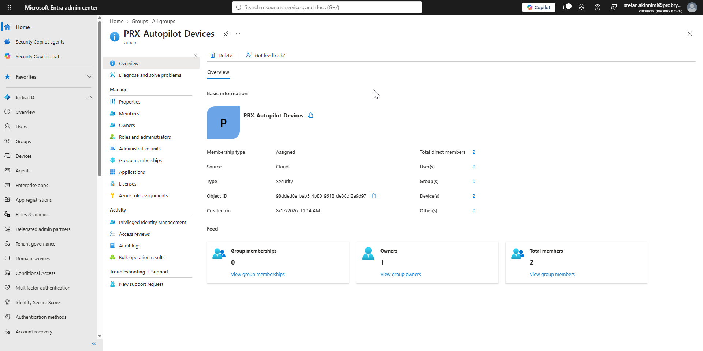

---

## 5️⃣ Create the Autopilot Deployment Profile

I created a Windows Autopilot deployment profile for the two devices.

1. I opened **Intune admin center → Devices → Windows → Enrollment**.
2. I opened **Deployment Profiles** under Windows Autopilot.
3. I selected **Create profile → Windows PC**.
4. I named the profile:

```text
PRX_Windows11_UserDriven
```

5. I selected **User-driven** as the deployment mode.
6. I configured the profile for **Microsoft Entra joined** deployment.
7. I configured the OOBE settings required for the lab.
8. I assigned the profile to `PRX-Autopilot-Devices`.

### 📸 Screenshots

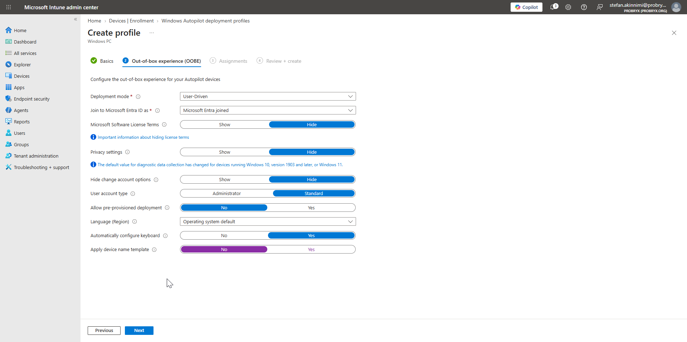

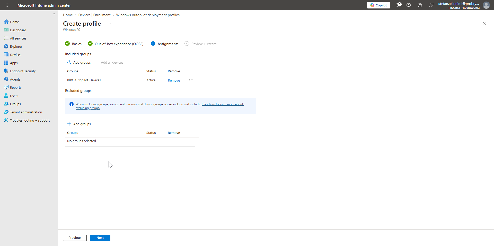

---

## 6️⃣ Configure the Enrollment Status Page

I configured an **Enrollment Status Page (ESP)** `PRX_Enrollment_Status_Page` profile so I could control the deployment experience while Intune applications and policies were being applied.

I assigned the ESP to the Autopilot devices.

### 📸 Screenshot

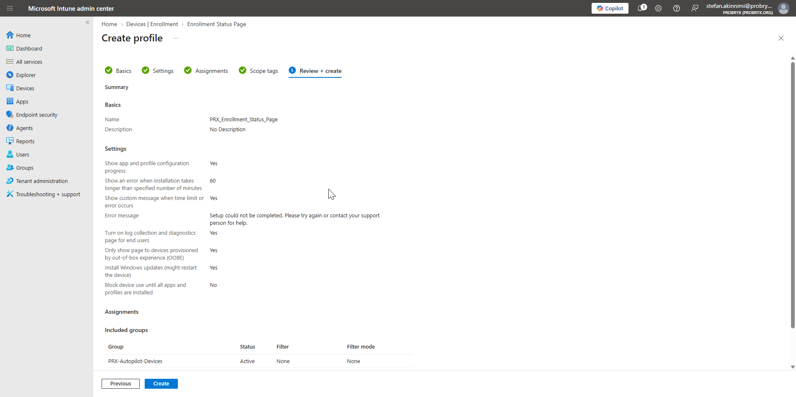

---

## 7️⃣ Assign Users to the Autopilot Devices

I assigned the intended users:

| Device | User |
|---|---|
| `PRX-WIN11-003` | Jane Smith |
| `PRX-WIN11-004` | Michael Brown |

### 📸 Screenshot

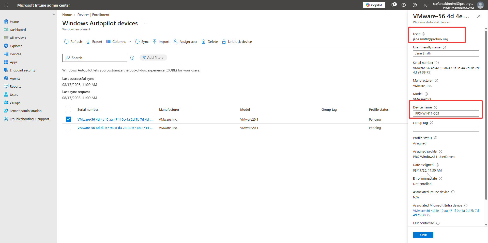

---

## 8️⃣ Verify Autopilot Profile Assignment

Before deploying the VMs, I verified that the Autopilot deployment profile had been assigned.

1. I opened **Windows Autopilot Devices**.
2. I selected the device.
3. I checked **Profile Status**.
4. I confirmed that the status showed **Assigned**.

### 📸 Screenshot

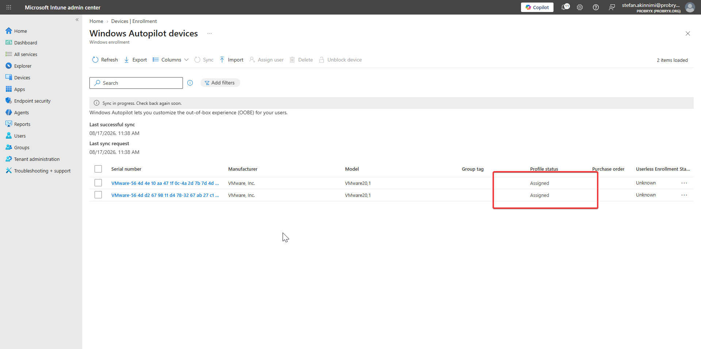

---

## 9️⃣ Deploy PRX-WIN11-003

I reset `PRX-WIN11-003` so that it returned to the Windows Out-of-Box Experience.

1. I started the Windows 11 VM.
2. I completed the initial language, region, and keyboard selections.
3. I connected the VM to the internet.
4. Windows detected the Autopilot registration.
5. The configured organizational OOBE experience was displayed.
6. I signed in using **Jane Smith's** Microsoft 365 account.
7. Windows joined the device to Microsoft Entra ID.
8. The device enrolled into Microsoft Intune.
9. The Enrollment Status Page processed the assigned policies and applications.
10. Windows completed the deployment.

### 📸 Screenshots

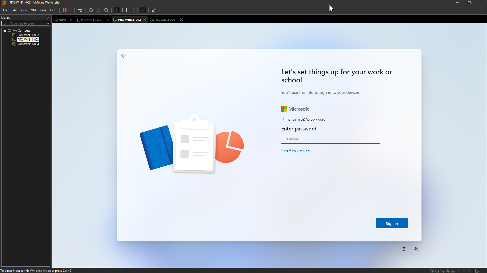

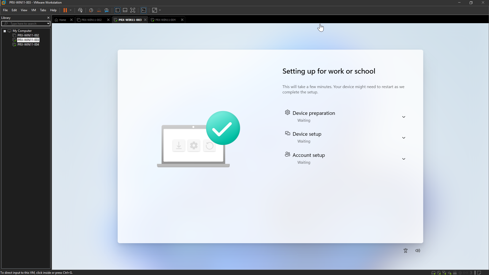

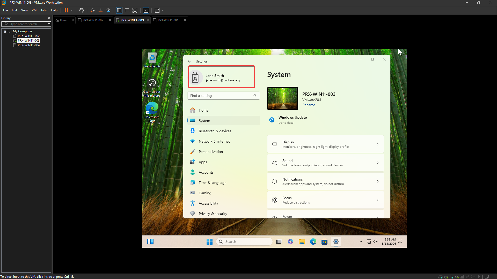

---

## 🔟 Deploy PRX-WIN11-004

I repeated the same user-driven Autopilot deployment process for `PRX-WIN11-004`, assigning it to **Michael Brown**.

1. I reset the Windows 11 VM to OOBE.
2. I connected the device to the internet.
3. Windows detected the Autopilot registration.
4. I signed in using **Michael Brown's** Microsoft 365 account.
5. The device joined Microsoft Entra ID.
6. The device enrolled into Microsoft Intune.
7. The Enrollment Status Page processed the assigned configuration.
8. Windows completed the Autopilot deployment.

### 📸 Screenshots

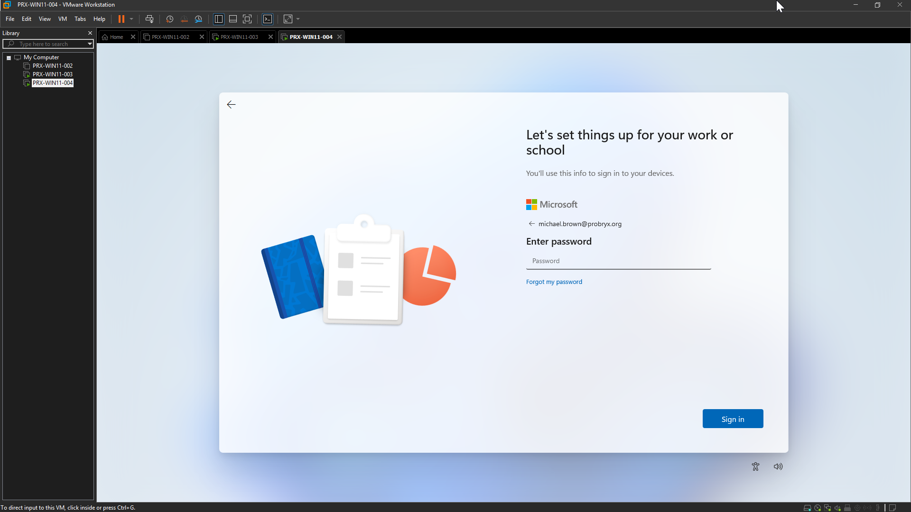


---

## ✅ Validation

I verified that:

- ✅ `PRX-WIN11-003` is registered in Windows Autopilot.
- ✅ `PRX-WIN11-004` is registered in Windows Autopilot.
- ✅ Both devices have an assigned Autopilot deployment profile.
- ✅ Both devices use user-driven Microsoft Entra join.
- ✅ Jane Smith's device completed Autopilot deployment.
- ✅ Michael Brown's device completed Autopilot deployment.
- ✅ Both devices are enrolled in Microsoft Intune.
- ✅ Both devices are Microsoft Entra joined.
- ✅ The Enrollment Status Page was used during deployment.

## 📌 Result

I successfully configured Windows Autopilot for two Windows 11 VMware virtual machines and demonstrated a user-driven deployment experience for Jane Smith and Michael Brown.

The lab now contains two enrollment approaches:

```text
Standard Enrollment
├── PRX-WIN11-001 → Damilola Ogunwole
└── PRX-WIN11-002 → Stefan Akinnimi

Windows Autopilot
├── PRX-WIN11-003 → Jane Smith
└── PRX-WIN11-004 → Michael Brown
```

## 🔗 Microsoft References

- [Windows Autopilot user-driven mode](https://learn.microsoft.com/en-us/autopilot/user-driven)
- [Configure Windows Autopilot profiles](https://learn.microsoft.com/en-us/autopilot/profiles)
- [Manual registration of devices for Windows Autopilot](https://learn.microsoft.com/en-us/autopilot/manual-registration)
- [Windows Autopilot registration overview](https://learn.microsoft.com/en-us/autopilot/registration-overview)
- [Windows Autopilot for pre-provisioned deployment](https://learn.microsoft.com/en-us/autopilot/pre-provision)
