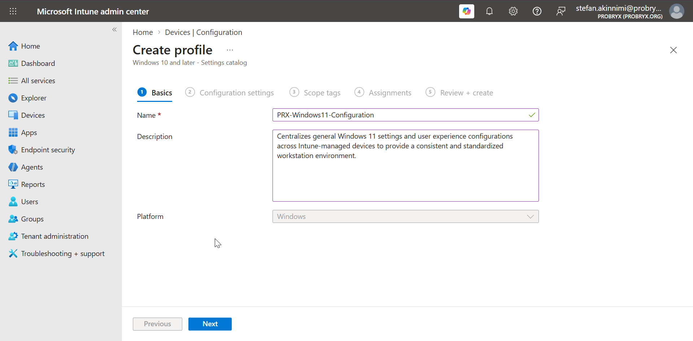

# ⚙️ Device Configuration

## 🎯 Objective

In this stage, I configured general Windows device settings in Microsoft Intune using **Configuration Profiles** and the **Settings Catalog**.

I focused on Windows configuration and user experience settings. Security-specific controls such as BitLocker, Defender, Firewall, and Attack Surface Reduction are handled separately in **Endpoint Security**.

## 🖥️ Devices

The configuration profiles are assigned to my Windows 11 devices:

- `PRX-WIN11-001` — Damilola Ogunwole
- `PRX-WIN11-002` — Stefan Akinnimi
- `PRX-WIN11-003` — Jane Smith
- `PRX-WIN11-004` — Michael Brown

---

## 1️⃣ Create the Windows Configuration Profile

I created a Windows configuration profile using the Settings Catalog.

1. I opened the **Microsoft Intune admin center**.
2. I navigated to **Devices → Manage devices → Configuration**.
3. I selected **Create → New policy**.
4. For **Platform**, I selected **Windows 10 and later**.
5. For **Profile type**, I selected **Settings catalog**.
6. I named the profile:

```text
PRX-Windows11-Configuration
```

7. I added a description explaining the purpose of the profile.

### 📸 Screenshot



---

## 2️⃣ Add General Windows Settings

I used the Settings Catalog to configure general Windows settings for the managed devices.

I searched for and configured relevant settings for:

- Windows tips and suggestions
- Consumer experience
- Lock screen behavior
- Windows Spotlight
- Optional Windows experiences where appropriate

I kept these settings focused on creating a consistent business workstation experience.

### 📸 Screenshot


---

## 3️⃣ Add Sign-In and User Experience

I configured general sign-in and user experience settings that belong in device configuration.

I reviewed and configured settings related to:

- Interactive sign-in behavior
- Screen lock behavior
- Password-related user experience
- Available Windows sign-in options

### 📸 Screenshot


---

## 4️⃣ Configure Microsoft Edge

I created a separate Settings Catalog profile for Microsoft Edge.

```text
PRX-Microsoft-Edge-Configuration
```

I configured Microsoft Edge settings to provide a consistent browser experience across my managed devices.

Examples include:

- Startup behavior
- Browser update behavior
- Selected browser features
- User experience settings

### 📸 Screenshot


---

## 5️⃣ Configure OneDrive

I created a separate configuration profile for Microsoft OneDrive.

```text
PRX-OneDrive-Configuration
```

I configured the available OneDrive settings required for the lab to provide a consistent cloud-storage experience across the Windows devices.

### 📸 Screenshot


---

## 6️⃣ Assign the Configuration Profiles

I assigned the profiles to:

```text
PRX-Intune-All-Devices
```

The main profiles were:

| Profile | Purpose |
|---|---|
| `PRX-Windows11-Configuration` | General Windows settings |
| `PRX-Microsoft-Edge-Configuration` | Microsoft Edge settings |
| `PRX-OneDrive-Configuration` | OneDrive settings |

I kept the assignments simple so the same baseline configuration could be applied consistently across the lab devices.

### 📸 Screenshot


---

## 7️⃣ Sync the Devices

After assigning the profiles, I triggered a device sync and allowed the policies to apply.

I used the Intune device actions and verified that the devices checked in successfully.

### 📸 Screenshot


---

## 8️⃣ Verify Policy Application

I verified the configuration from the Intune admin center.

I opened:

**Devices → Manage devices → Configuration**

and reviewed the deployment status of each profile.

I checked the device status to confirm that the configuration was successfully received.

### 📸 Screenshot


---

## ✅ Validation

I verified that:

- ✅ The Windows configuration profiles were created successfully.
- ✅ The profiles were assigned to the intended devices.
- ✅ The devices received the assigned configuration.
- ✅ Microsoft Edge settings were applied.
- ✅ OneDrive settings were applied.
- ✅ General Windows settings were applied.
- ✅ Security-specific controls were kept separate for the Endpoint Security stage.

## 📌 Result

I established a centralized Windows 11 configuration baseline for my Intune-managed devices.

The next stage is **Compliance Policies**, where I will define the conditions a device must meet to be considered compliant.
